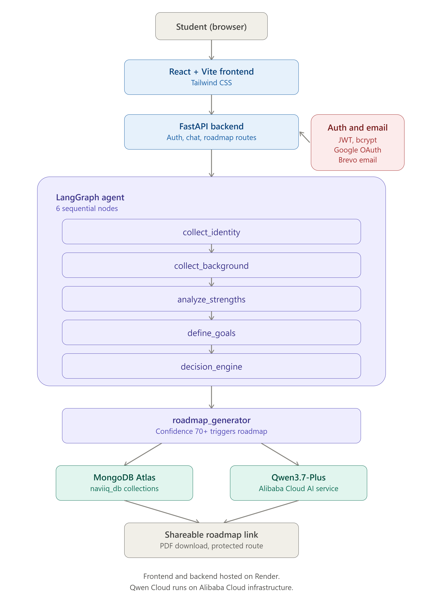

```markdown
# Naviiq

Naviiq is an AI-powered career guidance agent built for African students. It has a natural conversation with a student, learns about their background, interests, strengths, and goals, then generates a personalized career roadmap they can save, download, and share.

This project was built for the **Global AI Hackathon with Qwen Cloud**, under **Track 4: Autopilot Agent**.

## Why Naviiq

Many African students, especially in underserved communities, do not have access to proper career counseling. Naviiq fills that gap with an AI agent that asks the right questions, adapts to the student's age and context, and produces a roadmap that is specific to them rather than generic advice.

The agent supports three conversation modes depending on the student's age:

- **Explorer** (under 13): simple, encouraging, exploratory questions
- **Discovery** (13 to 17): guidance focused on subjects, interests, and early direction
- **Career** (18+): deeper conversation focused on career paths, skills, and concrete next steps

## How It Works

Naviiq is powered by a 6-node LangGraph agent. Each node has a single responsibility, gathers information through conversation, and hands off to the next node until enough context is built to generate a roadmap.

```
collect_identity to collect_background to analyze_strengths to define_goals to decision_engine to roadmap_generator
```

- **collect_identity**: gathers name, age, and current school/work status
- **collect_background**: explores academic background and areas of interest
- **analyze_strengths**: identifies the student's natural strengths and working style
- **define_goals**: understands what the student wants to achieve and their constraints
- **decision_engine**: matches the student's profile against career paths and computes a confidence score
- **roadmap_generator**: generates the final personalized roadmap once confidence is high enough (70% or above)

Each node makes a single call to **Qwen3.7-Plus** via Qwen Cloud, using the conversation history and accumulated state to produce both a natural response and structured data used to track progress.

## Architecture



The frontend is a React + Vite single-page app that talks to a FastAPI backend. The backend handles authentication, manages chat sessions, and routes messages through the LangGraph agent. All session data, student profiles, and generated roadmaps are stored in MongoDB Atlas. Authentication is handled with JWT access and refresh tokens stored in httpOnly cookies, with Google OAuth as an alternative login method. Transactional emails (verification, password reset) are sent through Brevo.

## Features

- Full conversational onboarding with adaptive tone based on student age
- Real-time progress indicator showing which stage of the conversation the student is in
- AI-generated personalized career roadmap with a match confidence score
- Shareable roadmap links that can be opened without logging in to the full app
- PDF download of the generated roadmap
- Secure authentication with JWT, bcrypt password hashing, and httpOnly cookies
- Google OAuth login
- Forgot password and reset password flow with email delivery via Brevo
- Automatic access token refresh using an axios interceptor, so sessions do not break mid-conversation
- Protected routes for the chat and roadmap pages

## Tech Stack

**Backend**
- FastAPI (Python)
- LangGraph for the agent workflow
- MongoDB Atlas for data storage
- Qwen3.7-Plus via Qwen Cloud (dashscope-intl.aliyuncs.com)
- JWT, bcrypt, httpOnly cookies for authentication
- Brevo for transactional email

**Frontend**
- React
- Vite
- Tailwind CSS
- Axios with a refresh-token interceptor
- jsPDF and html2canvas for PDF generation

## Project Structure

```
naviiq/
├── app/
│   ├── agents/        # LangGraph agent and node definitions
│   ├── core/           # Configuration and settings
│   ├── db/              # Database connection
│   ├── models/      # Pydantic models
│   ├── routes/        # API route handlers (auth, chat)
│   ├── main.py
│   └── utils.py        # Email sending utilities
├── frontend/
│   ├── src/
│   │   ├── pages/        # Landing, Login, Register, Chat, Roadmap, etc.
│   │   └── services/   # API client with token refresh
│   └── package.json
└── README.md
```

## Getting Started

### Prerequisites

- Python 3.10+
- Node.js 18+
- A MongoDB Atlas connection string
- A Qwen Cloud API key
- A Brevo API key (for email)

### Backend Setup

```bash
cd naviiq
python -m venv venv
venv\Scripts\activate
pip install -r requirements.txt
uvicorn app.main:app --reload
```

The backend runs on `http://localhost:8000`

### Frontend Setup

```bash
cd naviiq/frontend
npm install
npm run dev
```

The frontend runs on `http://localhost:5173`

### Environment Variables

Create a `.env` file in the backend root with the following:

```
MONGODB_URI=your_mongodb_connection_string
QWEN_API_KEY=your_qwen_cloud_api_key
JWT_SECRET=your_jwt_secret
BREVO_API_KEY=your_brevo_api_key
BREVO_SENDER_EMAIL=your_sender_email
GOOGLE_CLIENT_ID=your_google_oauth_client_id
GOOGLE_CLIENT_SECRET=your_google_oauth_client_secret
```

## Deployment

Naviiq is built to run on Alibaba Cloud infrastructure, using Qwen Cloud for all AI inference.

## License

This project is licensed under the MIT License.

## Author

Built by Moses Abiodun Iluyemi as part of the Global AI Hackathon with Qwen Cloud.
```